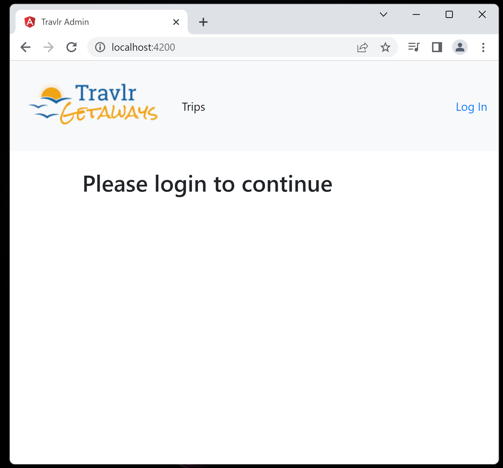
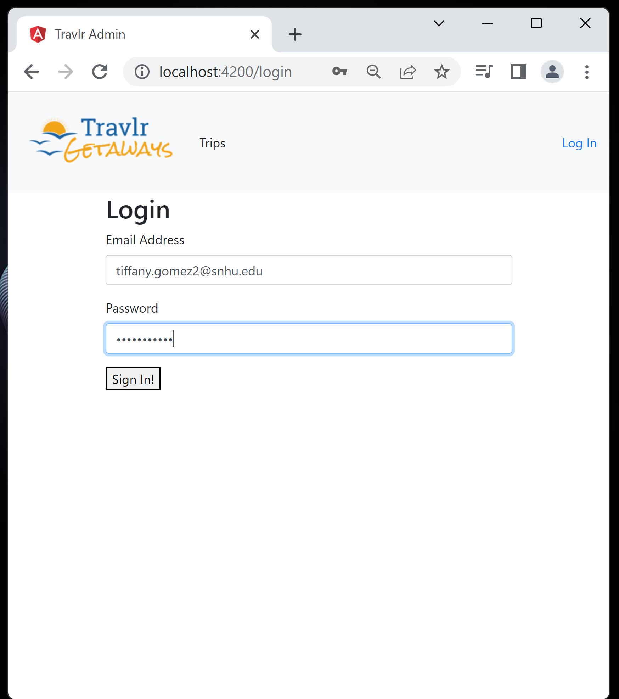

# CS-465 Full Stack Development with MEAN
## Travlr Getaways

<i> This is a data-driven, interactive web application developed using the MEAN stack. Users receive content directly from the server, and a Single Page Application (SPA) has developed for Travlr Getaways administrators to manage the application and database. The components of MEAN work cohesively as Express is designed to operate on top of Node.js, and AngularJS has a built-in connection to Node.js, allowing for fast data serving. Node.js includes an integrated web server, facilitating the deployment of the MongoDB database and application. </i>

MEAN stack is ideal due to its architectural flexibility, allowing us to leverage Nodejs and Express' power, flexibility, and speed for the public-facing website, while leveraging SPA's efficiency for administrative purposes. Both ends are connected to a NoSQL MongoDB database, which gives us the freedom to define our schema and enforce certain parts without being constrained. 

## Architecture
Both the Angular project and the Express HTML customer-facing pages adhere to the Model-View-Controller (MVC) architecture pattern. In the web application, the client runs in a web browser (Angular) and at times communicates with the server. After that, the server (Express) retrieves and stores data for the client, maintaining a clear difference between client and server to simplify app maintenance and testing.

In the client-facing Express project, all data elements and other information are retrieved from the database and returned to the client-facing website, where the pages are generated. Handlebars are to improve the rendering speeds of the HTML pages.  Due the static nature of the client facing HTML pages, JavaScript is used to enable interaction with the backend database to make the pages dynamic reflect user behavior. 

While the Express’ project’s structure features a lot of communication between the server and the client-side browser, the Angular instead moves a significant portion of the burden to the browser by initially loading the majority of what is required as a single-page application (SPA). With SPAs, data is presented to users dynamically. JavaScript operates within the browser, needing no page reloads or added wait time because content is automatically downloaded. As opposed to Express where every time a user accesses a new page in a simple web application interaction, a request is sent to the server to download a new HTML page.

As for the backend, MongoDB is our choice of a fast and scalable NoSQL database supports the various data types the site will need and will aid in delivering high performance and availability. Its high flexibility is due to storing data in JSON-like document format grouped in collections. Due to its horizontal scale-out architecture, the web application will have no trouble adjusting to user demands.

## Functionality
Most of this app, from the database objects to the code on the client side, is written in the scripting language JavaScript. This makes the development process more uniform. JSON is a data format that is derived from JavaScript. This user-friendly format is great for storing and transferring data, as mentioned in MongoDB, as well as sending data from the server to the pages. By sending HTTP requests with JSON bodies, the front end and back-end development work can be tied together. In this application, our trip data is structured using key and value pairs.

An Instance in the full stack process where refactored code improved the functionality and efficiencies of the web application is when we used Handlebars to dynamically generate the HTML pages. Because the content in the hbs files is static and hard-coded, every time we want to make a change, a change to the HTML must also be made. By refactoring the common functionality of the headers and footers into partials, handlebars allowed us to reuse certain parts of the templates with partials we created for headers and footers. As a result, the number of lines of template code is reduced when repetitive content is stored in JSON files, making it simpler for developers to add and modify content. In addition, because of the adjustments made to the controller, rather than using the clients' browsers, we now directly access the local file system on the web server. Therefore, reusable user interface (UI) components reduce the size of the web application overall, speed up and streamline the development process, and reduce the likelihood of introducing errors and vulnerabilities.

## Testing
In a full stack application, the methods of the website are what drives the functionality and dynamics of a webpage allowing for a standardized approach to containing business logic in an API. The methods GET, POST, PUT, and DELETE are http requests that can be used to retrieve, create, retrieve, modify, or remove data from the database so that the functionality can be implemented. These are driven on the backend by using the functions of the database such as, create, findOne, and findOneAndUpdate, depending on a user’s behavior. Endpoints provide us with a url to access those methods, either publicly or privately with some sort of authentication, such as tokens or certificates. They produce outcomes reflected as codes that signify successful or failed requests (200, 201, 400), that may be tested using tools such as Postman. 

The login security features make the site more secure because we safeguarded the user data kept in the browser using JWTs and hashes and salts to implement one-way password encryption. In the login process we created this week, after we registered a user and logged in, those credentials were verified by the server using the database and a JSON Web Token (JWT) was returned. 

The application decoded the JWT and changing the view to display the add tip and edit trip functionality when logged in and removing those features while logged out. Still only implementing authentication and authorization security features is not enough for the web application as it is not enough to prevent vulnerabilities that could be present in the site. For example, improper implementation of input validation and error handing could lead to SQL injection and other injection vulnerabilities as a result of poor input and output handling.

## Reflection
Full stack development is a valuable skill in the technology sector because it requires developers to be proficient in both front-end and back-end programming. This course has increased my knowledge of client/server programming, REST APIs, and web application security and testing. I have knowledge of JavaScript frameworks applicable to the development of dynamic web apps and websites. This project has given me a competitive edge in the job market after graduation and the confidence to pursue further full stack development projects on my own.
